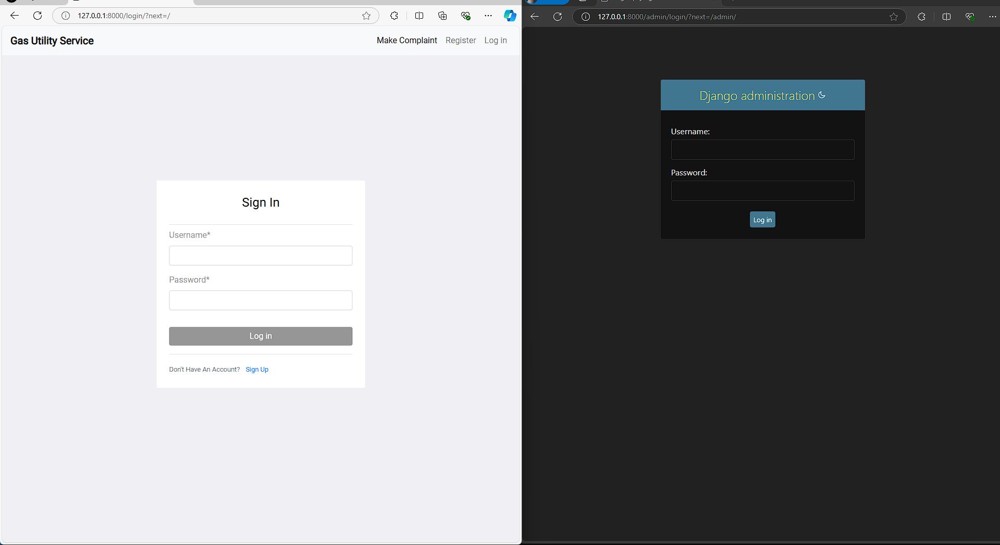

## Installation
- **Linux/Mac**

1. Create and active virtual environment using   
` virtualenv -p python3 env`  
` cd venv`  
`source bin/activate`  
2. Change the directory using  
`cd ..`  
` cd Complain_Management_System` 
3. Now you need to install python packages to run the app  
`pip3 install -r requirements.txt`
4. Migrations  
`python manage.py makemigrations`
`python manage.py migrate`
5. Run Django app  
`python manage.py runserver`

- **Windows**

1. Install and active virtual environment using   
`pip install virtualenv`  
`virtualenv env`  
`env\Scripts\activate`  
2. Change the directory using  
` cd Complain_Management_System` 
3. Now you need to install python packages to run the app  
`pip3 install -r requirements.txt`
4. Migrations  
`python manage.py makemigrations` 
`python manage.py migrate --run-syncdb`
5. Run Django app  
`python manage.py runserver`
